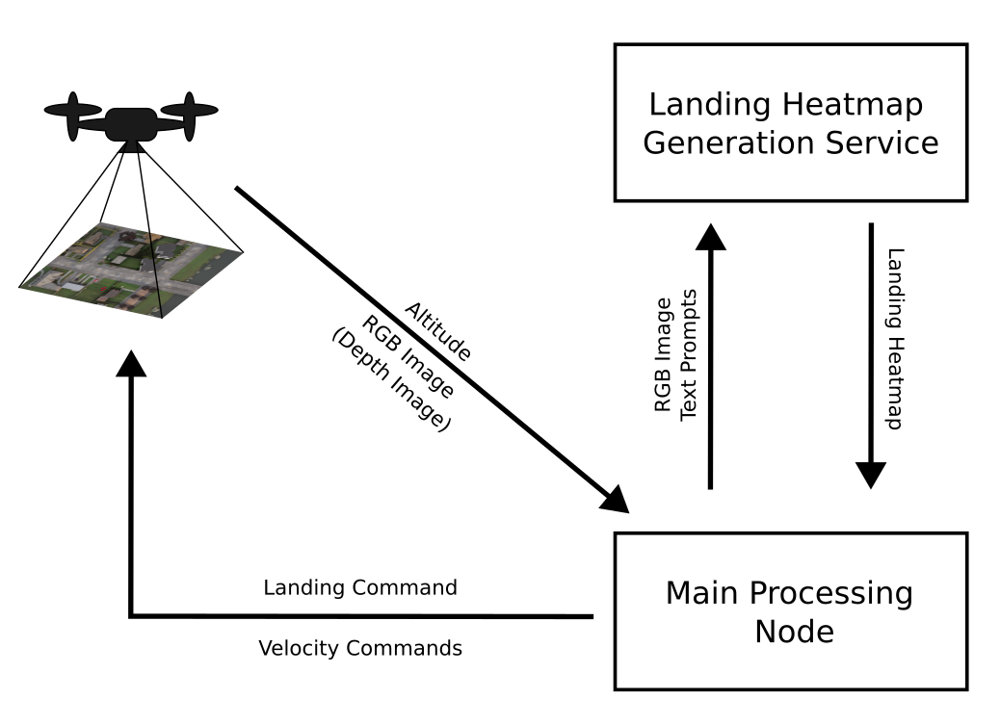
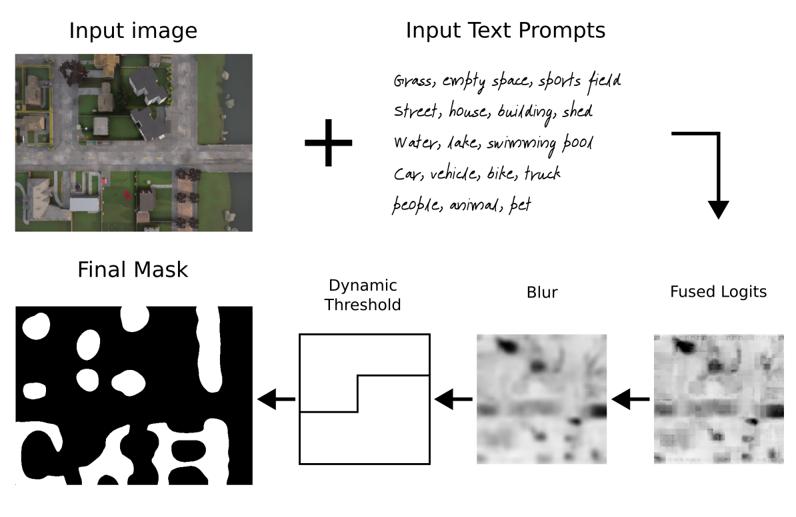
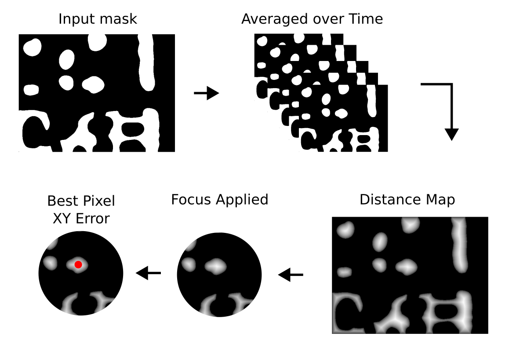

# DOVESEI: Dynamic Open Vocabulary Enhanced Safe-landing with Intelligence

The main goal of this work is to study the use of a Focused Open Vocabulary Enhanced Visual Servoing to reactively land a UAV in "the safest" possible way only using one small camera (e.g. monocular system with Raspicam v2 or stereo with OAK-D Lite), in absense of communication with any external sources, and all the computation needed running onboard without intervention from human operators. Here we define "the safest" choice as a place selected only using the onboard perception system and with a probability of causing harm that is lower than an otherwise random uncontrolled landing. Additionally, it needs to work in different scenarios, only changing a few parameters, without needing extensive collection of data to fine tune any internal model, hence the choice for an "open vocabulary" based model. Moreover, as the system won't be able to receive or send data, external positioning like a Global Navigation Satellite System (GNSS), Ultra-Wideband Positioning (UWB), laser or radio guidance, or external markers (e.g. APRIL, ArUco) won't be available. On the other hand, it's expected the UAV can be controlled by an external system through velocity commands and it's capable of rudimentary 3D position hold (altitude and lateral movements) to avoid major drifting, consequently there's no need for precise odometry or a 3D map of the environment. 

An inherent advantage of the proposed methodology lies in its adaptability across diverse scenarios. By requiring only minimal parameter adjustments, this approach can cater to varying environments and operational conditions without necessitating extensive data collection or recalibration.

Many previous systems dealt with automatic UAV landing, but they would limit the maximum altitude (e.g. the OAK-D Lite has a small baseline, 75mm, limiting its maximum depth range to less than 19m), use more expensive and heavier sensors (e.g. 3D lidars), or scan and create a map of the environment (SLAM) before deciding where to land. Finally, past use of machine learning models meant those systems would not tolerate domain shifts as they were trained and tested for very specific scenarios.

Our motivation is to study a minimum viable system, capable of running even with only a monocular RGB camera, that can "focus" according to its state and leverage open vocabulary models to allow it to be easily "tuned" only using language without extensive data collection. Moreover, according to the onboard sensors and computational capacity, such a system can be easily used in parallel to other methods that offer odometry and 3D mapping for further improvements.

## System Architecture:
The proposed system architecture comprises two distinct but interconnected processes. These processes are delineated as the "Landing Heatmap Generation Service" and the "Main Processing Node." 


### 1. Landing Heatmap Generation Service:
The first component of the system involves the "Landing Heatmap Generation Service" which operates in conjunction with a RGB input image and textual prompts. This service serves as a preliminary step in the landing process, generating a comprehensive heatmap that provides critical insights into suitable landing locations. The service harnesses both visual and linguistic inputs to create an informed representation of potential landing zones. The final ouput is a grayscale image where the white areas correspond to the best places to land and, therefore, the black ones are treated as obstacles. Since this is a service running asynchronously and in parallel to the main processing node, it's easier to test different methods to generate the landing heatmap.


### 2. Main Processing Node:
The second core component of the system is the "Main Processing Node." This node serves as the central hub of the landing operation, overseeing the post-processing of information derived from the heatmap generated by the Landing Heatmap Generation Service. The primary objective of the Main Processing Node is to post-process the heatmap data focusing on specific areas according to the current state, incorporate navigational parameters, and facilitate real-time decision-making. 
When a stereo camera makes depth images available, they will be used to generate two extra boolean signals related to approaching obstacles and the flatness of the ground below it, both controlled by static and dynamic threshold values. Nevertheless, when the distance exceeds a specific threshold linked to the baseline distance, causing saturation in the resultant depth image, a stereo camera reverts to a monocular configuration. In such circumstances, solely the landing heatmap is employed.

The UAV will filter the received landing heatmap to reduce the flickering effects, mask the regions to focus on the areas where the UAV may land, and use the final filtered version to decide the best location, initially in pixel coordinates, to land. This decision is based on three main factors: a) how big is the area; b) its perimeter length; and c) how close it's to the centre of the image. The motivation is to give priority to places close to the current position (centre of the image), with as much free space as possible (big area and simple shape / perimeter). The objective function then becomes `objective = (1/perimeter)*area/(dist2center+1)`, the closed shapes (countours) are sorted accordingly, and an error signal is generated based on the closed shape with highest objective and an internal pixel with the highest distance transform value (i.e. the pixel inside the selected shape that is the furthest away from obstacles).

Moreover, according to the received value for the current altitude, and using the field of view (FOV) of the camera, an approximate projection of the drone on the ground is calculated. This projection is used to focus certain states to the areas close to where the UAV aims to land on. The altitude is also used to verify if the safe altitude (lateral collision free) was breached and when the "land" command needs to be sent to the UAV allowing its internal flight controller to finallise the landing procedure.



Main Processing Node splits the landing process into six distinct states:
 
1. `SEARCHING`: Coarse search for a landing spot from a safe altitude
2. `AIMING`: Refined search to better align the UAV with safe landing spot
3. `LANDING`: Descend while checking for dynamic obstacles
4. `WAITING`: Stop and wait for a certain amount of time if the obstacles where detected after it started landing
5. `CLIMBING`: Climb back to a safe altitude where there are no obstacles if the waiting phase took too long
6. `RESTARTING`: Restart the coarse search by moving away from the last tentative landing spot


#### 1. `SEARCHING`: Coarse search for a landing spot from a safe altitude
An important assumption at this state is that the UAV can move in the XY plane freely as there are no obstacles at this altitude (safe altitude) in this particular area (e.g. 50m). Many municipalities limit the maximum height of structures, therefore the assumption of a obstacle-free XY plane is a valid one. At this state, only lateral movements are allowed in order to keep the UAV at the same altitude. The published speeds are generated based on the XY error from the landing heatmap post-processing as a simple proportional controller.

The UAV will stay in the `SEARCHING` state until the error (approximated distance to the "best" landing spot in its reach) falls below an adjustable threshold value. At this point it will switch to the next state, `AIMING`.


#### 2. `AIMING`: Refined search to better align the UAV with safe landing spot
The `AIMING` state was devised to help the system better centre the UAV before switching to the `LANDING` state thus reducing the number of restarts. It has four major differences in relation to the previous state (`SEARCHING`): it adds an integrator to the controller, it reduces the controller gains, it uses the UAV ground projection and the defined safety radius to focus only on values within that circle, and it slowly descends until it reaches a minimum of 110% the safety altitude value. The combination of these three strategies help the system to improve its precision leading to a better yield at the `LANDING` state.


#### 3. `LANDING`: Descend while checking for dynamic obstacles
When the XY error falls below a certain threshold (user defined parameter), the system enters the `LANDING` state. At this state the UAV descends with a speed that decreases as it gets closers to the ground. The same "focus" strategy used during the `AIMING` state is used here, but its range is reduced. Lateral movements are not allowed as this system was devised for a simple setup using a UAV without precise odometry, any means to map the environment or sensors to detect possible lateral collisions. In the event of a change in the enviroment suggesting the area below the UAV is not safe for landing anymore, the system switches momentaneously to the `WAITING` state. Otherwise it will descend until it reaches the pre-programmed altitude where the landing control is passed to the UAV's flight controller.


#### 4. `WAITING`: Stop and wait for a certain amount of time if the obstacles where detected after it started landing
While the system is in the `LANDING` state, it will stop and switch to `WAITING` whenever it detects a change in the area projected for landing that suggests it's become unsafe. At the moment it enters the current state all movements stop and a timer is started. If the amount of time in this state is bigger than a pre-programmed parameter, the system considers the current position a failed landing procedure and switches to the `CLIMBING` state, otherwise it will switch back to `LANDING` as soon as the projected landing area below the UAV becomes free of obstacles. 


#### 5. `CLIMBING`: Climb back to a safe altitude where there are no obstacles
Considering the previous state, `WAITING`, reached its maximum allowed time (ajustable parameter), the system cancels the landing and climbs to a safe altitude. Again, it moves straight upwards without lateral movements. When the altitude surpasses the value set as the safe altitude, the system initiates the `RESTARTING` state.

#### 6. `RESTARTING`: Restart the coarse search by moving away from the last tentative landing spot
The `RESTARTING` state is aimed at avoiding getting stuck in a local minima where the UAV would try to land at the same spot over and over. It uses the current processed landing heatmap to choose the direction to move. If there are more than one, it chooses the second best to set its direction, otherwise it simply moves forward. It keeps this movement for a certain amount of time (ajustable parameter) before switching to `SEARCHING` where the process of finding a safe place to land the UAB will literally restart.


## Implementation and Use
The system was designed as a ROS 2 service and a main processing node. It expects to have available topics publishing RGB images, depth images and the coordinate frames (world / map and UAV / camera) - the coordinate frames are used only to read the UAV's above ground level (AGL) altitude, and it will publish velocity commands. The nodes themselves don't have any special dependency in relation to ROS 2 (tested only on Galactic), but they expect a system with Pytorch 1.13 and Huggingface Transformers 4.30.2. You can find a docker image and instruction in how to use it [here](https://github.com/ricardodeazambuja/ros2_quad_sim_python), but launch the docker container (from the directory where you cloned this repository, don´t forget to ask git to get the submodules with `git clone --recurse-submodules`) using:
```
launch_ros2_desktop.sh -g --image ricardodeazambuja/ros2_quad_sim_python:pytorch
```
(you can find the Dockerfiles [here](https://github.com/ricardodeazambuja/ros2_quad_sim_python/tree/main/docker))

With the docker container started, remember to build the packages:
```
colcon build --symlink-install --packages-select ros2_open_voc_landing_heatmap ros2_open_voc_landing_heatmap_srv
```
And
```
source install/setup.bash
```

We created two launch files that allow to test the system:
### 1. Using our adaptation of the CARLA Simulator for use with UAVs (see the instructions [here](https://github.com/ricardodeazambuja/ros2_quad_sim_python) for more details):

```
ros2 launch ros2_open_voc_landing_heatmap start.launch.py
```

### 2. Using our [Aerial View Simulator](https://github.com/ricardodeazambuja/ros2_satellite_aerial_view_simulator) that uses real-world satellite images:
```
ros2 launch ros2_open_voc_landing_heatmap start_aerialview.launch.py
```
Use `--show-args` to see explanations about the available parameters.

## Results from Initial Pilot Experiments
### Using Satellite Images [(Aerial View Simulator)](https://github.com/ricardodeazambuja/ros2_satellite_aerial_view_simulator):
In the samples below, the system was started at randomly chosen places in France (because they have high resolution free tiles), at an altitude of 100m, and it only had access to the RGB image and the current altitude while the depth was saturated. The parameters were the default ones from [this launch file](https://github.com/ricardodeazambuja/ros2_open_voc_landing_heatmap/blob/e2d333c98daec0e9a223d1f67c035b4e51bcf0c1/src/ros2_open_voc_landing_heatmap/launch/start_aerialview.launch.py). The original videos generated using [ffmpeg](https://www.ffmpeg.org/) including all images, but with a fixed time between frames, are [here](assets/videos/) (for some reason GitHub is failing to show the videos using the html5 `<video>` tag, hence the gifs below...).


## Known Problems and Future Improvements
Risking repeating the introduction, the primary motivation behind this work is to explore an alternative approach. Rather than relying on conventional solutions rooted in SLAM and path planning, this study aims to investigate the feasibility of transferring the majority of the system's intelligence to an open-vocabulary semantic segmentation model. Such systems achieve high scores in zero-shot tasks and, therefore, offer improved generalisation capabilities over models that use a closed vocabulary (e.g. a model trained on MS COCO classes). Moreover, an open vocabulary model allows to be "fine tuned" just by means of prompt engineering.

However, previous works have shown that "with great generalisation power comes lower accuracy", and this is a trade-off that this work hopes to investigate deeper in the future. Finally, the field of prompt engineering is quite new and any development could bring improvements to this work probably without the need of training an expensive new model.

# TODO
* Improve code structure
* Change parameter names to make them easier to understand (and choose a naming convention to follow...)
* Add more details to this README file
